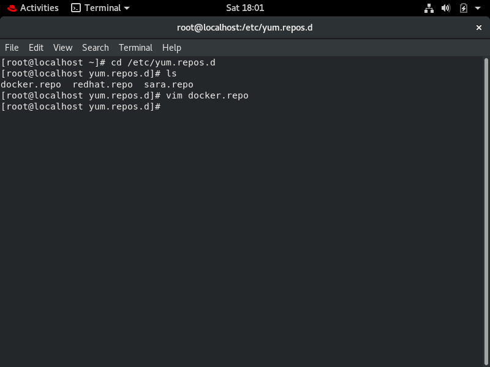
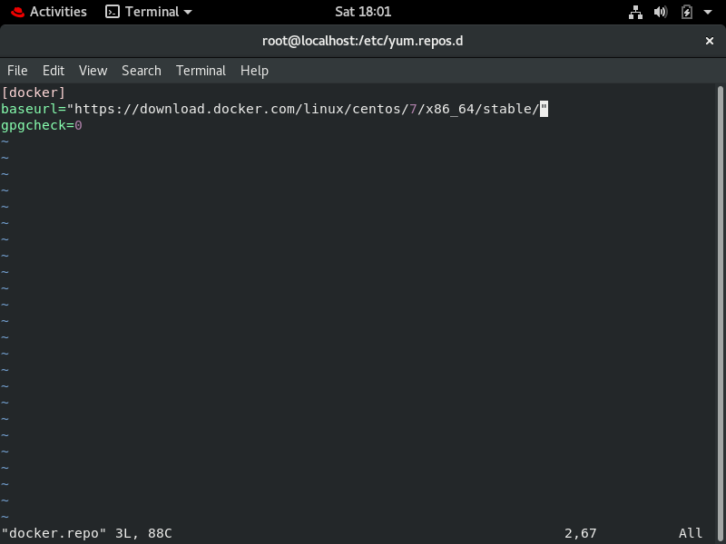
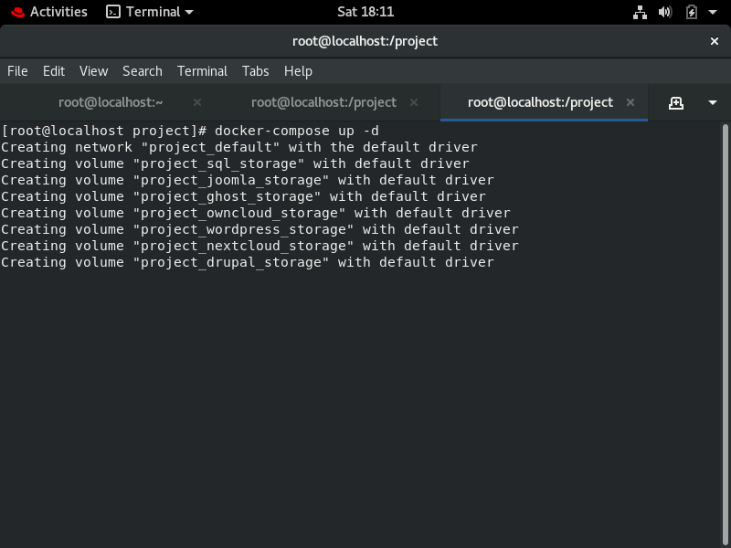
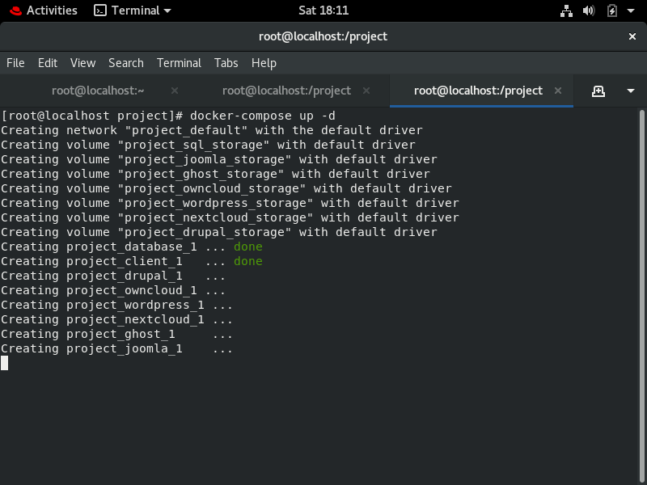
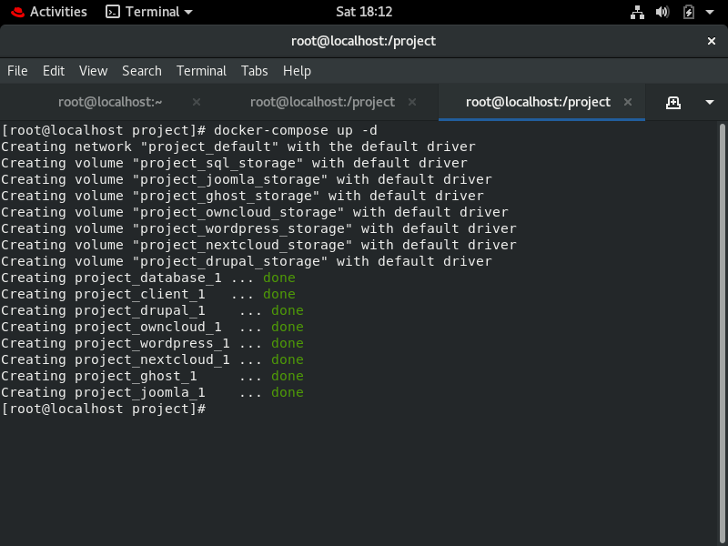
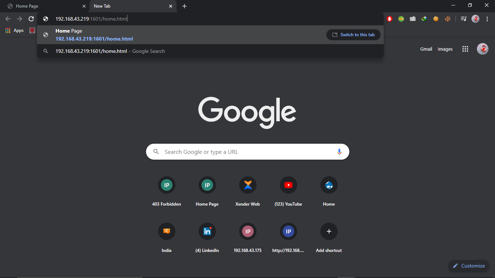
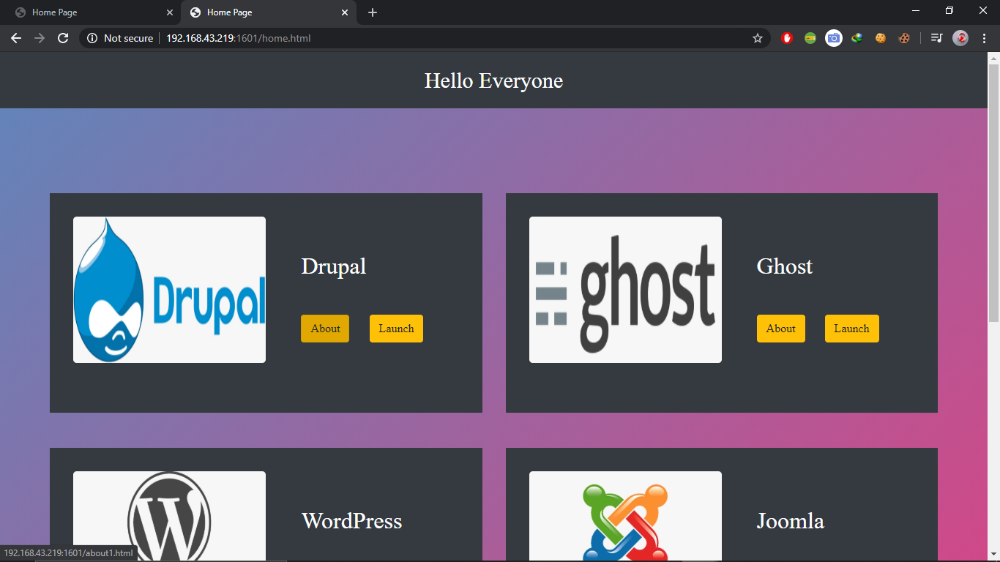
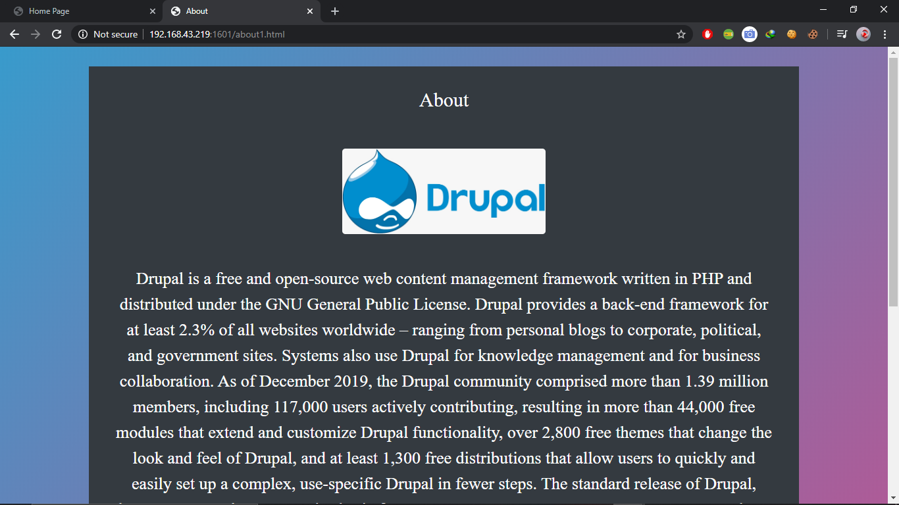
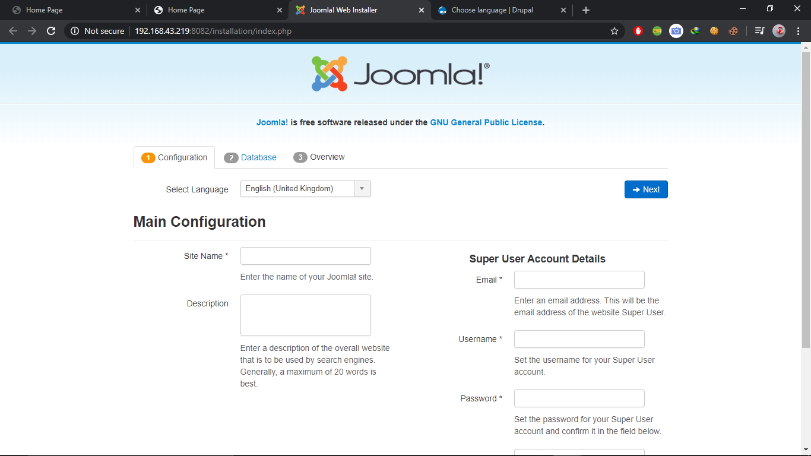

# IIEC-RISE-DOCKER-COMPOSE-PROJECT
This project works on docker-compose as if the server will get disconnected then it will take to launch the new web server. So, docker can launch within 1 sec and it has MySQL to permanent storage of the data.

## Project Title

It provides access to your data through a web interface, providing a platform to view, sync and share across devices easily — all under your control. This project works on docker-compose as if the server will get disconnected then it will take to launch the new web server. So, docker can launch within 1 sec and it has MySQL to permanent storage of the data.

## Requirements/Installation

These instructions will get you a copy of the project up and running on your local machine for development and testing purposes. See deployment for notes on how to deploy the project on a live system.

### Make sure you have the latest versions of Docker and Docker Compose installed on your machine.

For installing run the commands:

## For Docker Installation on RedHat/Centos:

Configure yum in RedHat/Centos to add Docker for local installation 

using "https://download.docker.com/linux/centos/docker-ce.repo" put this link in the file in /etc/yum.repos.d/






Now, run command

```
yum install docker-ce --nobest
```

## Start Docker:

```
systemctl start docker
```

## After Docker installation, install Docker Compose:-

```
curl -L https://github.com/docker/compose/releases/download/1.21.2/docker-compose-`uname -s`-`uname -m` -o /usr/local/bin/docker-compose
chmod +x /usr/local/bin/docker-compose
```

After installation of the above files:-

```
systemctl start docker
systemctl enable docker
```

Make a file using 

```
mkdir project/        (you can give any name)
cd project/
```


Now copy the docker-compose.yml file to this dir
After that make one more directory inside the project directory 


```
mkdir docker-html/
cd docker-html/
```

Now copy the docker-html folder inside this directory


### Installation completed..


## Usage:

### Linux firewall didnot allow you to connect to the sql so you have to stop it first

```
systemctl stop firewalld
iptables -F
setenforce 0
iptables -P FORWARD ACCEPT
iptables -t filter -F
iptables -t filter -x
systemctl restart docker
```
Run these command to stop the firewall services and iptables.

#### Go to the project folder in which the .yml file is and run the following command:

```
docker-compose up -d    (for rumming in background)
docker-compose up       (to see the activities)
```

This will get the docker images from docker hub so you have internet connectivity in your system.
And also it will create the Docker volumes reqiured by the .yml file. 









### Everything is set now. 


You should be able to access the site with the IP of your host in the windows browser or any browser who is connected with LAN.

Run the following command in any browser:

```
(IP of your host system):1601/home.html                {for ex:192.168.43.219:1601/home.html}
```










## And to stop the docker compose:

```
docker-compose stop
```


## Built With

* RHEL-8 Running in Virtual Box
* Docker
* Docker-compose
* Docker images:
	* Mysql
	* Nginx 
	* Wordpress
	* joomla
	* Drupal
	* owncloud
	* Next cloud
	* Ghost

## Author

[SAURAV PATEL](https://www.linkedin.com/in/saurav-patel-148539151/)
